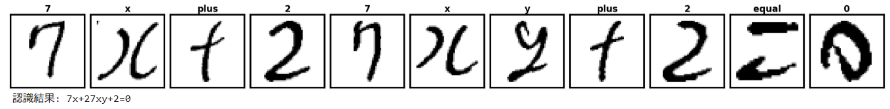

# Hand-Written Math Formula Recognition System

手書きの数式画像を解析し、各記号を分離・認識してデジタルテキストへ変換するエンドツーエンドの認識システムです。(分数や微積、行列式には対応していません）
CNN（畳み込みニューラルネットワーク）を用いた画像分類に加え、記号の位置関係に基づいた構造解析（べき乗判定）や、誤認識をその場で修正してモデルを更新する対話型学習機能を備えています。

## 主な機能

* **ハイブリッド・データセット**: 
    * HASYv2（数学記号）とMNIST（数字）を統合し、数学記号と数字の双方に強い30種類のクラスを定義。
* **高度なデータ拡張 (Data Augmentation)**: 
    * 回転、スケーリング、太さ変更（膨張・収縮）に加え、記号の特性に応じた適切な加工を行い、各クラス6,000枚までデータを増強。
* **数式構造の解析**: 
    * 隣接する記号との高さ比較による**べき乗（上付き文字）**の自動判定。
    * 「zと2」「yと7」など、形状が類似する記号に対する文脈補正ロジック。
* **対話型修正学習 (Human-in-the-loop)**: 
    * 推論結果が誤っていた場合、実行時にユーザーが正しいラベルを入力することで、その場でモデルを追加学習（微修正）させることが可能。

## 使用データセットとライセンス

本プロジェクトでは、以下のデータセットを利用しています。

### 1. HASYv2 Dataset
* **内容**: 手書きの数学記号データセット。
* **ライセンス**: [CC BY-SA 4.0](https://creativecommons.org/licenses/by-sa/4.0/)
* **引用**: Thoma, M. (2017). The HASYv2 dataset. arXiv preprint arXiv:1701.08380.

### 2. MNIST Dataset
* **内容**: 手書き数字データセット。
* **ライセンス**: [CC BY-SA 3.0](https://creativecommons.org/licenses/by-sa/3.0/) (Yann LeCun, Corinna Cortes and Christopher J.C. Burges)

## 認識デモ

システムが数式を各記号に分割し、個別にラベル付けを行っている様子です。

*認識結果の例: `7x+27xy+2=0`*

## 🛠 動作環境

| 項目 | バージョン / 詳細 |
| :--- | :--- |
| **OS** | Windows 11 |
| **Python** | 3.13.9 |
| **Deep Learning** | PyTorch 2.6.0, Ultralytics 8.4.21 |
| **Computer Vision** | OpenCV 4.13.0.92 |
| **Dataset** | HASYv2, MNIST |

## プロジェクト構成

1.  **データ準備・拡張 (`collect_hasy`, `collect_mnist`)**:
    * 各データセットから必要な記号を抽出し、白背景・黒文字への正規化およびリサイズを実施。
2.  **モデル定義 (`MathFormulaCNN`)**:
    * 3層の畳み込み層と2層の全結合層からなるCNN。48x48ピクセルの入力を受け取り、30クラスの分類を行います。
3.  **画像解析パイプライン**:
    * ガウシアンフィルタによるノイズ除去、適応的二値化、輪郭抽出を用いたセグメンテーションを実行。
    * アスペクト比を維持したパディング処理による、モデルへの入力精度向上。
4.  **対話型学習インターフェース**:
    * Matplotlibで認識対象の画像を表示しながら、ユーザー入力を受け付けてモデルの重みを即座に更新。

## 使用方法

1.  `Formula_discrimination.ipynb` をJupyter環境で開きます。
2.  「データ準備」セクションを実行し、学習用データセットを生成します。
3.  「学習」セクションを実行してモデル（`math_universal_model.pth`）を訓練・保存します。
4.  「テスト」セクションで手書き画像のパスを指定し、数式認識を実行します。
5.  誤認識がある場合は、表示される入力フォームから対話的にモデルを修正・最適化できます。

---
Developed by Itsuki Takeshima
